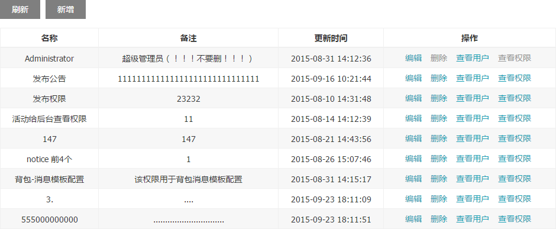

# nd-grid

[](http://spm.crossjs.com/package/nd-grid)

> 基于模板的数据表格



## 安装

```bash
$ spm install nd-grid --save
```

## 使用

```js
var Grid = require('nd-grid');
```

### 简单运用

```js
new Grid({
  parentNode: '#main',
  // RESETful
  proxy: new RbacRoleModel(),
  // no pagination
  mode: 2,
  labelMap: {
    'role_name': '名称',
    'remarks': '备注',
    'updated_at': '更新时间'
  }
}).render();
```

### 复杂运用

```js
new Grid({
  parentNode: '#main',
  // RESETful
  proxy: new RbacRoleModel(),
  // 处理待发送到服务端的请求数据
  inFilter: function(data) {
    data.size = data.$limit;
    delete data.$limit;

    data.page = data.$offset / data.size;
    delete data.$offset;

    return data;
  },
  // 处理服务端返回的数据
  outFilter: function(data) {
    data &&
    data.items &&
    data.items.forEach(function(item, index) {
      item.id = index + 1;
    });

    return data;
  },
  // 指定 uniqueId
  uniqueId: 'role_id',
  // 隐藏查看详情入口
  entryKey: null,
  labelMap: {
    // 'role_id': 'ID',
    'role_name': '名称',
    'remarks': '备注',
    'updated_at': '更新时间'
  },
  // 单元格数据转换
  adapters: function(key, value) {
    if (key === 'updated_at') {
      return value ? datetime(value).format() : '-';
    }

    return value;
  },
  // 自定义插件
  plugins: [{
    name: 'roleUser',
    starter: require('./user/starter')
  }, {
    name: 'roleAuth',
    starter: require('./auth/starter')
  }],
  // 预置与自定义插件的选项
  pluginCfg: {
    addItem: {
      disabled: false,
      listeners: {
        start: require('./add/start')
      }
    },
    editItem: {
      disabled: false,
      listeners: {
        start: require('./edit/start')
      }
    },
    delItem: {
      disabled: false,
      listeners: {
        start: require('./del/start')
      }
    }
  }
}).render();
```
